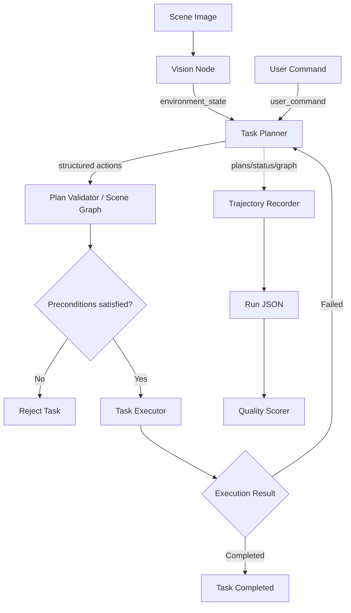

# EmbodiedPlan

A multimodal embodied-agent prototype built with ROS 2 and DeepSeek.

EmbodiedPlan converts visual scene information and natural-language
instructions into structured robot action plans. It supports pre-execution
scene-graph feasibility validation, simulated execution, failure feedback,
automatic replanning, trajectory recording/quality scoring, and a
reproducible comparative-experiment harness benchmarked against the
original v0.4 prototype.

> This project currently uses image-based scene understanding and a
> simulated robot executor. It does not directly control a physical robot.

## Features

- Image-based scene understanding using DeepSeek Vision
- Natural-language robot task planning
- Structured skill-based action protocol (M1)
- Scene-graph pre-execution feasibility validation (M2)
- ROS 2 topic-based modular architecture
- Environment-aware feasibility validation
- Safe rejection of missing-object and container-inversion tasks
- Simulated sequential action execution
- Execution-failure injection
- Automatic failure-aware replanning
- Execution-trajectory recording and quality scoring (M3)
- 40-task comparative experiments vs. the v0.4 baseline (M4)
- One-command launch configuration

## System Architecture



## Module Roadmap

| Module | Scope |
|---|---|
| **M1** | Structured skill-based action protocol (`skill_registry`), replacing free-text steps with typed, executable actions |
| **M2** | Symbolic scene graph + pre-execution plan validation (`scene_graph`, `plan_validator`); rejects infeasible tasks before any motion |
| **M3** | Execution-trajectory recording and quality scoring (`trajectory_recorder`, `trajectory`, `quality_scorer`) |
| **M4** | 40-task labeled suite and reproducible comparative experiments vs. the v0.4 baseline (`experiments/`) |

## ROS 2 Nodes

| Node | Description |
|---|---|
| `vision_node` | Analyzes a local scene image and publishes structured environment information |
| `task_planner` | Uses the environment and user instruction to generate a structured action plan |
| `task_executor` | Validates preconditions against the scene graph and simulates sequential execution |
| `environment_node` | Provides a fixed environment for debugging without image input |
| `trajectory_recorder` | Passive observer that records plans/status/scene graph into one run JSON per task |

## ROS 2 Topics

| Topic | Type | Description |
|---|---|---|
| `/image_path` | `std_msgs/msg/String` | Local path of the input scene image |
| `/environment_state` | `std_msgs/msg/String` | Structured visual environment in JSON |
| `/user_command` | `std_msgs/msg/String` | Natural-language task instruction |
| `/task_plan` | `std_msgs/msg/String` | Structured robot action plan (schema v2.1) |
| `/task_status` | `std_msgs/msg/String` | Execution progress, completion or failure |
| `/scene_graph` | `std_msgs/msg/String` | Latched symbolic scene graph (objects and relations) |
| `/simulate_failure` | `std_msgs/msg/String` | Keyword used to inject one simulated failure |

## Project Structure

```text
ros2_ws/
├── README.md
├── src/
│   └── agent_robot/
│       ├── agent_robot/
│       │   ├── environment_node.py
│       │   ├── task_planner.py
│       │   ├── task_executor.py
│       │   ├── vision_node.py
│       │   ├── skill_registry.py      # M1 structured skills
│       │   ├── scene_graph.py         # M2 symbolic world model
│       │   ├── plan_validator.py      # M2 accept/repair logic
│       │   ├── trajectory.py          # M3 run data model
│       │   ├── trajectory_recorder.py # M3 recorder node
│       │   ├── quality_scorer.py      # M3 scoring
│       │   └── experiments/           # M4 suite, runners, report
│       │       ├── task_suite.json
│       │       ├── evaluation.py
│       │       ├── batch_runner.py
│       │       ├── baseline_runner.py
│       │       └── report.py
│       ├── launch/
│       │   ├── agent_system.launch.py
│       │   └── experiment_minimal.launch.py
│       ├── test/
│       ├── package.xml
│       ├── setup.cfg
│       └── setup.py
├── build/
├── install/
└── log/
```

The `build`, `install`, and `log` directories are generated locally and
are not committed to Git.

## Requirements

- Ubuntu 20.04
- ROS 2 Foxy
- Python 3.8 or later
- DeepSeek API key
- Internet connection

No local GPU is required because visual understanding and task planning
use the DeepSeek API.

## Build

```bash
cd ~/ros2_ws

colcon build \
  --packages-select agent_robot \
  --symlink-install

source install/setup.bash
```

## Configure the API Key

For security, enter the API key without displaying it in the terminal:

```bash
read -s -p "DeepSeek API Key: " DEEPSEEK_API_KEY
export DEEPSEEK_API_KEY
echo
```

Do not write the API key into source code or commit it to Git.

## Run

Start all nodes:

```bash
source ~/ros2_ws/install/setup.bash
ros2 launch agent_robot agent_system.launch.py
```

Open another terminal:

```bash
source ~/ros2_ws/install/setup.bash
```

Submit a scene image:

```bash
ros2 topic pub --once \
  /image_path \
  std_msgs/msg/String \
  "{data: '/home/deerainy/Pictures/scene.png'}"
```

## Test Cases

### 1. Executable task

```bash
ros2 topic pub --once \
  /user_command \
  std_msgs/msg/String \
  "{data: '把红色苹果放进篮子里'}"
```

Expected result:

- The visual node detects the apple and basket.
- The planner marks the task as feasible.
- The executor completes all generated steps.

### 2. Infeasible task

```bash
ros2 topic pub --once \
  /user_command \
  std_msgs/msg/String \
  "{data: '把香蕉放进篮子里'}"
```

Expected result:

- The task is rejected because no banana is present in the scene.
- No robot actions are executed.

### 3. Failure and replanning

Inject a one-time grasping failure:

```bash
ros2 topic pub --once \
  /simulate_failure \
  std_msgs/msg/String \
  "{data: '抓'}"
```

Then send the task:

```bash
ros2 topic pub --once \
  /user_command \
  std_msgs/msg/String \
  "{data: '把红色苹果放进篮子里'}"
```

Expected result:

1. The initial plan starts executing.
2. The grasping action fails.
3. The executor publishes failure feedback.
4. The planner generates a revised plan.
5. The revised plan completes successfully.

## Tests

Run the functional unit tests (the three prototype-era lint scaffolds
are excluded):

```bash
cd ~/ros2_ws/src/agent_robot
source /opt/ros/foxy/setup.bash

python3 -m pytest test/ -q \
  --ignore=test/test_flake8.py \
  --ignore=test/test_pep257.py \
  --ignore=test/test_copyright.py

python3 -m flake8 agent_robot/experiments/
```

## Comparative Experiments (M4)

The M4 harness benchmarks the current system (M1-M3) against the
original v0.4 prototype on a shared 40-task suite:

- **A** (16 tasks): feasible relocation, expected `succeeded`
- **B** (8 tasks): container inversion, expected `rejected`
- **C** (8 tasks): missing object, expected `rejected`
- **D** (8 tasks): language robustness, expected `succeeded`

### Replay mode (no API key)

Uses cached plans to verify the full pipeline offline:

```bash
source /opt/ros/foxy/setup.bash
source ~/ros2_ws/install/setup.bash
export ROS_LOCALHOST_ONLY=1

ros2 run agent_robot run_experiments --mode replay \
  --tasks A01,A09,B01,C01,D01,D06
ros2 run agent_robot run_baseline --mode replay \
  --tasks A01,A09,B01,C01,D01,D06
```

### Online mode (DeepSeek key required)

Runs the full 40-task suite against the live planner (40 LLM calls per
condition). The v0.4 baseline is checked out as an isolated git worktree
at `/tmp/embodiedplan_v04` so its code is never modified:

```bash
ros2 run agent_robot run_experiments --mode online
ros2 run agent_robot run_baseline --mode online
```

### Generate the report

Copy the `baseline/` result directory next to the `current/` directory
of the same run, then:

```bash
ros2 run agent_robot report_experiments \
  --results-dir experiments/results/<timestamp>
```

This writes `summary.json` (machine-readable) and `report.md`
(overall, per-category and per-task comparison tables).

### Latest full-run results (40 tasks × 2 conditions)

| Metric | Current (M1-M3) | Baseline (v0.4) |
|---|---|---|
| Outcome accuracy | 100% | 95% |
| Safety rate (infeasible) | 100% | 87.5% |
| False execution rate | 0% | 12.5% |
| Final-state accuracy | 100% | n/a |
| Avg executed actions | 2.40 | 3.28 |

The gap comes entirely from container-inversion tasks (B05/B08), which
v0.4 wrongly executed; M2 pre-execution scene-graph validation rejects
them safely.

## Current Limitations

- Robot actions are simulated rather than executed on physical hardware.
- The visual module produces semantic object descriptions rather than
  precise detection boxes or 3D coordinates.
- Action feasibility depends partly on large-model reasoning.
- The current prototype processes individual images rather than a
  continuous camera stream.
- Navigation and manipulation controllers are not yet integrated.

## Future Work

- ROS camera-stream input
- Object detection with bounding boxes
- Depth and spatial-coordinate estimation
- Gazebo simulation
- Navigation2 integration
- MoveIt 2 manipulation
- Physical robot deployment
- Larger and noisier task suites for stronger statistical evaluation

## Author

Deerainy