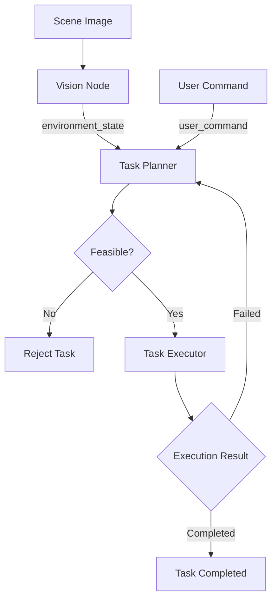

# EmbodiedPlan

A multimodal embodied-agent prototype built with ROS 2 and DeepSeek.

EmbodiedPlan converts visual scene information and natural-language
instructions into structured robot action plans. It supports task
feasibility validation, simulated execution, failure feedback, and
automatic replanning.

> This project currently uses image-based scene understanding and a
> simulated robot executor. It does not directly control a physical robot.

## Features

- Image-based scene understanding using DeepSeek Vision
- Natural-language robot task planning
- ROS 2 topic-based modular architecture
- Environment-aware feasibility validation
- Rejection of tasks involving missing objects
- Simulated sequential action execution
- Execution-failure injection
- Automatic failure-aware replanning
- One-command launch configuration

## System Architecture



## ROS 2 Nodes

| Node | Description |
|---|---|
| `vision_node` | Analyzes a local scene image and publishes structured environment information |
| `task_planner` | Uses the environment and user instruction to generate an action plan |
| `task_executor` | Simulates sequential execution and publishes execution status |
| `environment_node` | Provides a fixed environment for debugging without image input |

## ROS 2 Topics

| Topic | Type | Description |
|---|---|---|
| `/image_path` | `std_msgs/msg/String` | Local path of the input scene image |
| `/environment_state` | `std_msgs/msg/String` | Structured visual environment in JSON |
| `/user_command` | `std_msgs/msg/String` | Natural-language task instruction |
| `/task_plan` | `std_msgs/msg/String` | Structured robot action plan |
| `/task_status` | `std_msgs/msg/String` | Execution progress, completion or failure |
| `/simulate_failure` | `std_msgs/msg/String` | Keyword used to inject one simulated failure |

## Project Structure

```text
ros2_ws/
├── README.md
├── src/
│   └── agent_robot/
│       ├── agent_robot/
│       │   ├── environment_node.py
│       │   ├── task_executor.py
│       │   ├── task_planner.py
│       │   └── vision_node.py
│       ├── launch/
│       │   └── agent_system.launch.py
│       ├── package.xml
│       ├── setup.cfg
│       └── setup.py
├── build/
├── install/
└── log/
```

The `build`, `install`, and `log` directories are generated locally and
are not committed to Git.

## Requirements

- Ubuntu 20.04
- ROS 2 Foxy
- Python 3.8 or later
- DeepSeek API key
- Internet connection

No local GPU is required because visual understanding and task planning
use the DeepSeek API.

## Build

```bash
cd ~/ros2_ws

colcon build \
  --packages-select agent_robot \
  --symlink-install

source install/setup.bash
```

## Configure the API Key

For security, enter the API key without displaying it in the terminal:

```bash
read -s -p "DeepSeek API Key: " DEEPSEEK_API_KEY
export DEEPSEEK_API_KEY
echo
```

Do not write the API key into source code or commit it to Git.

## Run

Start all nodes:

```bash
source ~/ros2_ws/install/setup.bash
ros2 launch agent_robot agent_system.launch.py
```

Open another terminal:

```bash
source ~/ros2_ws/install/setup.bash
```

Submit a scene image:

```bash
ros2 topic pub --once \
  /image_path \
  std_msgs/msg/String \
  "{data: '/home/deerainy/Pictures/scene.png'}"
```

## Test Cases

### 1. Executable task

```bash
ros2 topic pub --once \
  /user_command \
  std_msgs/msg/String \
  "{data: '把红色苹果放进篮子里'}"
```

Expected result:

- The visual node detects the apple and basket.
- The planner marks the task as feasible.
- The executor completes all generated steps.

### 2. Infeasible task

```bash
ros2 topic pub --once \
  /user_command \
  std_msgs/msg/String \
  "{data: '把香蕉放进篮子里'}"
```

Expected result:

- The task is rejected because no banana is present in the scene.
- No robot actions are executed.

### 3. Failure and replanning

Inject a one-time grasping failure:

```bash
ros2 topic pub --once \
  /simulate_failure \
  std_msgs/msg/String \
  "{data: '抓'}"
```

Then send the task:

```bash
ros2 topic pub --once \
  /user_command \
  std_msgs/msg/String \
  "{data: '把红色苹果放进篮子里'}"
```

Expected result:

1. The initial plan starts executing.
2. The grasping action fails.
3. The executor publishes failure feedback.
4. The planner generates a revised plan.
5. The revised plan completes successfully.

## Current Limitations

- Robot actions are simulated rather than executed on physical hardware.
- The visual module produces semantic object descriptions rather than
  precise detection boxes or 3D coordinates.
- Action feasibility depends partly on large-model reasoning.
- The current prototype processes individual images rather than a
  continuous camera stream.
- Navigation and manipulation controllers are not yet integrated.

## Future Work

- ROS camera-stream input
- Object detection with bounding boxes
- Depth and spatial-coordinate estimation
- Gazebo simulation
- Navigation2 integration
- MoveIt 2 manipulation
- Physical robot deployment
- Quantitative evaluation of planning and replanning performance

## Author

Luna