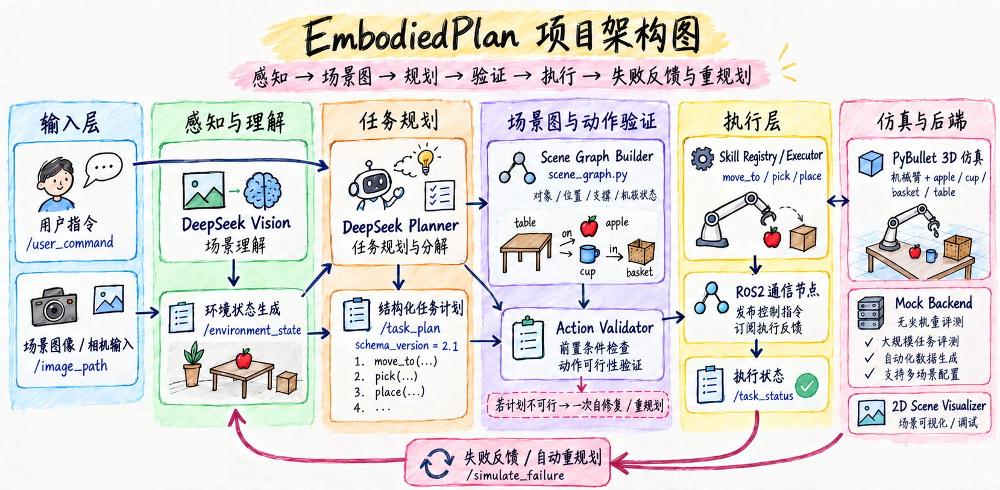
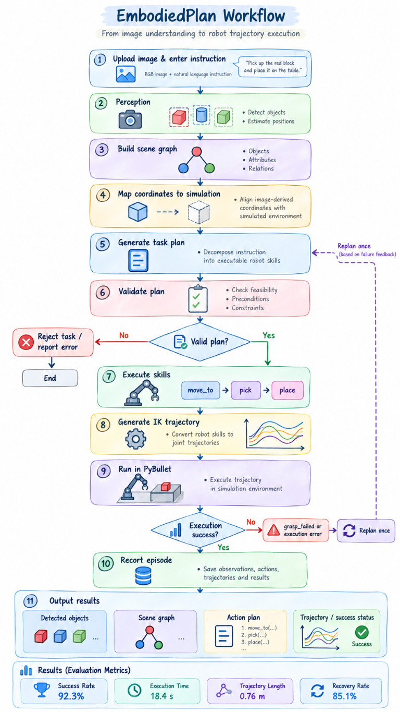
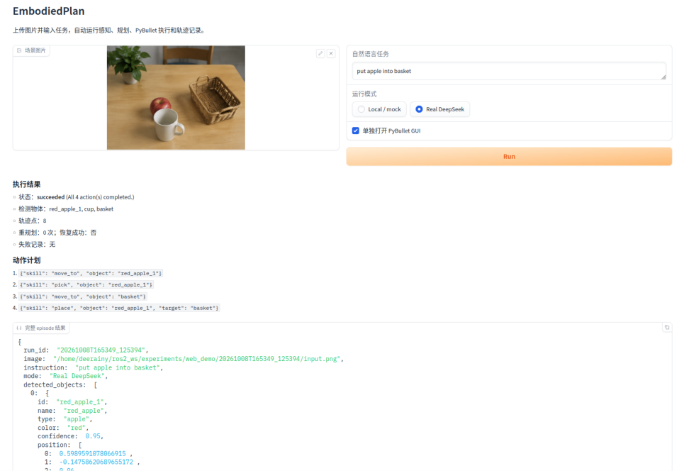
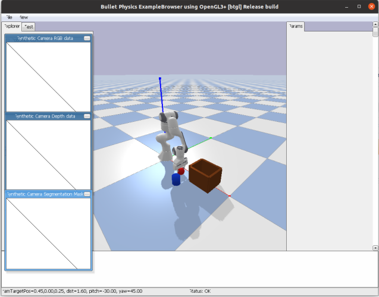

# EmbodiedPlan

<p align="center">
  <a href="https://github.com/deerainy/agent_robot">
    
  </a>
  <a href="https://www.python.org/">
    
  </a>
  <a href="LICENSE">
    
  </a>
</p>

**A vision-grounded embodied agent for image-conditioned robot task execution.**

EmbodiedPlan is a ROS 2 research prototype that turns a tabletop image and a
natural-language instruction into a validated, executable robot task. The
system detects objects, estimates tabletop positions, builds a structured
scene graph, plans object-level skills, generates PyBullet motion through
inverse kinematics, executes the task in simulation, and records the
resulting episode for inspection and evaluation.

The project supports two operating modes:

- **Local / mock:** OpenCV perception and deterministic mock planning for
  offline demos and tests.
- **Real models:** DeepSeek Vision perception and DeepSeek task planning,
  configured with API credentials in a local `.env` file.

> **Scope:** This is a simulation-focused research prototype, not a physical
> robot controller. Image-to-world mapping uses a fixed tabletop camera
> calibration and simulation-only placement correction; it is not general 3D
> reconstruction. See [Current Limitations](#current-limitations).

## System at a glance



*High-level system overview. Numeric callouts drawn inside this conceptual
illustration are illustrative artwork, not measured benchmark results; use
the evaluation table in [Final 30-episode evaluation](#final-30-episode-evaluation)
for the measured project results.*

## Table of contents

- [Features](#features)
- [System architecture](#system-architecture)
- [Project structure](#project-structure)
- [Requirements and installation](#requirements-and-installation)
- [Configure model APIs](#configure-model-apis)
- [Demos](#demos)
  - [Single-image offline demo](#1-single-image-vision-demo-offline)
  - [Multi-scene benchmark](#2-multi-scene-benchmark-30-episodes)
  - [Real-model demo](#3-real-model-demo)
  - [Web UI](#4-minimal-web-ui)
- [M5 benchmark and results](#m5-multi-scene-image-benchmark)
- [M4 comparative experiments](#comparative-experiments-m4)
- [Tests](#tests)
- [Limitations](#current-limitations)
- [License](#license)

## Features

- Image-based scene understanding using DeepSeek Vision
- Natural-language robot task planning
- Structured skill-based action protocol (M1)
- Scene-graph pre-execution feasibility validation (M2)
- ROS 2 topic-based modular architecture
- Environment-aware feasibility validation
- Safe rejection of missing-object and container-inversion tasks
- Simulated sequential action execution
- Execution-failure injection
- Automatic failure-aware replanning
- Execution-trajectory recording and quality scoring (M3)
- 40-task comparative experiments vs. the v0.4 baseline (M4)
- Seeded multi-scene simulation with a separate world-truth model (M5)
- Parameterized PyBullet objects/containers with headless DIRECT validation
- One-command launch configuration

## System architecture

The Web UI is a thin presentation and orchestration layer. It launches the
existing ROS 2 demo stack, publishes the user's instruction, and displays
the outputs; perception, planning, validation, execution, and recording
remain in their existing ROS nodes.



*End-to-end workflow. A failed grasp can trigger one feedback-driven replan;
terminal status and trajectory data are recorded as an episode.*

## Module Roadmap

| Module | Scope |
|---|---|
| **M1** | Structured skill-based action protocol (`skill_registry`), replacing free-text steps with typed, executable actions |
| **M2** | Symbolic scene graph + pre-execution plan validation (`scene_graph`, `plan_validator`); rejects infeasible tasks before any motion |
| **M3** | Execution-trajectory recording and quality scoring (`trajectory_recorder`, `trajectory`, `quality_scorer`) |
| **M4** | 40-task labeled suite and reproducible comparative experiments vs. the v0.4 baseline (`experiments/`) |
| **M5** | Seeded `SceneSpec` scenarios, instance-aware scene graphs, and a revisioned world model (`scenarios/`, `world_node`) |

## ROS 2 Nodes

| Node | Description |
|---|---|
| `vision_node` | Analyzes a local scene image and publishes structured environment information |
| `task_planner` | Uses the environment and user instruction to generate a structured action plan |
| `task_executor` | Validates preconditions against the scene graph and simulates sequential execution |
| `environment_node` | Provides a fixed environment for debugging without image input |
| `world_node` | Publishes a seeded episode's observable world state and applies scripted events |
| `trajectory_recorder` | Passive observer that records plans/status/scene graph into one run JSON per task |

## ROS 2 Topics

| Topic | Type | Description |
|---|---|---|
| `/image_path` | `std_msgs/msg/String` | Local path of the input scene image |
| `/environment_state` | `std_msgs/msg/String` | Structured visual environment in JSON |
| `/user_command` | `std_msgs/msg/String` | Natural-language task instruction |
| `/task_plan` | `std_msgs/msg/String` | Structured robot action plan (schema v2.1) |
| `/task_status` | `std_msgs/msg/String` | Execution progress, completion or failure |
| `/scene_graph` | `std_msgs/msg/String` | Latched symbolic scene graph (objects and relations) |
| `/simulate_failure` | `std_msgs/msg/String` | Keyword used to inject one simulated failure |
| `/world_event` | `std_msgs/msg/String` | Relocation event requested by the world model for a physics backend |
| `/world_event_ack` | `std_msgs/msg/String` | Physics-backend acknowledgement of a world event |

## Project Structure

```text
ros2_ws/
├── README.md
├── src/
│   └── agent_robot/
│       ├── agent_robot/
│       │   ├── environment_node.py
│       │   ├── task_planner.py
│       │   ├── task_executor.py
│       │   ├── vision_node.py
│       │   ├── perception/            # Detection, API and coordinate mapping
│       │   ├── web_demo.py            # Gradio presentation layer
│       │   ├── skill_registry.py      # M1 structured skills
│       │   ├── scene_graph.py          # M2 symbolic world model
│       │   ├── plan_validator.py       # M2 accept/repair logic
│       │   ├── world_node.py           # M5 episode truth publisher
│       │   ├── scenarios/              # M5 specs, generators, world model
│       │   ├── trajectory.py           # M3 run data model
│       │   ├── trajectory_recorder.py  # M3 recorder node
│       │   ├── quality_scorer.py       # M3 scoring
│       │   └── experiments/            # M4 suite, runners, report
│       │       ├── task_suite.json
│       │       ├── evaluation.py
│       │       ├── batch_runner.py
│       │       ├── baseline_runner.py
│       │       └── report.py
│       ├── launch/
│       │   ├── agent_system.launch.py
│       │   ├── experiment_minimal.launch.py
│       │   └── scenario_minimal.launch.py
│       ├── test/
│       ├── package.xml
│       ├── setup.cfg
│       └── setup.py
├── build/
├── install/
└── log/
```

The `build`, `install`, and `log` directories are generated locally and
are not committed to Git.

## Requirements and installation

- Ubuntu 20.04 and ROS 2 Foxy
- Python 3.8
- PyBullet and the package's Python dependencies
- Gradio 3.x only when running the optional Web UI
- A DeepSeek API key and internet access only for real-model mode

No local GPU is required because visual understanding and task planning
can use the DeepSeek API. The offline OpenCV detector is available by setting
`VISION_BACKEND=opencv`.

Clone the repository into a ROS 2 workspace's `src/` directory, then build:

```bash
mkdir -p ~/ros2_ws/src
cd ~/ros2_ws/src
git clone --branch feature/m5-multi-scene-sim \
  https://github.com/deerainy/agent_robot.git
cd ~/ros2_ws

source /opt/ros/foxy/setup.bash
colcon build \
  --packages-select agent_robot \
  --symlink-install
source install/setup.bash
```

For the Web UI, install the optional frontend dependency in the same Python
environment used by ROS:

```bash
python3 -m pip install 'gradio>=3.50,<4'
```

## Configure model APIs

Copy `.env.example` to `.env`, then enter your DeepSeek API key in
`DEEPSEEK_API_KEY`. `.env` is ignored by Git. The same DeepSeek key is used
for chat planning and vision by default; set `DEEPSEEK_VISION_API_KEY` only
if you have a separate key. The vision model/backend can be configured with
`DEEPSEEK_VISION_MODEL` and `VISION_BACKEND`.

Load the file in the terminal before launching ROS:

```bash
cd ~/ros2_ws
cp .env.example .env
# Edit .env locally; do not paste the key into a shell command.
nano .env
set -a
source .env
set +a
```

Do not write the API key into source code or commit it to Git.

## Demos

Build and source the workspace once:

```bash
cd ~/ros2_ws
source /opt/ros/foxy/setup.bash
colcon build --packages-select agent_robot --symlink-install
source install/setup.bash
```

### 1. Single-image vision demo (offline)

```bash
ros2 launch agent_robot vision_demo.launch.py \
  image_path:=src/agent_robot/images/2.png \
  pybullet_connection_mode:=DIRECT \
  vision_backend:=opencv \
  planner_mode:=mock
```

In another sourced terminal, issue a task:

```bash
ros2 topic pub --once /user_command std_msgs/msg/String \
  "{data: 'put apple into basket'}"
```

### 2. Multi-scene benchmark (30 episodes)

```bash
ros2 run agent_robot generate_benchmark_episodes \
  --output-dir datasets/m5_benchmark --count 30 --seed 42
ros2 launch agent_robot benchmark.launch.py \
  input_dir:=datasets/m5_benchmark \
  results_path:=experiments/final_results.json \
  planner_mode:=mock \
  vision_backend:=synthetic_opencv
```

The benchmark injects one `grasp_failed` probe in the first episode, then
records recovery, per-episode data, rates, average trajectory length and
execution time. See `experiments/final_results.json` and the adjacent
`experiments/final_results_episodes/` directory. The benchmark uses generated
RGB only for perception; its `scene_spec.json` ground truth is not passed to
the planner or detector.

### 3. Real-model demo

Set the API keys in the workspace `.env` file (ignored by Git):

```dotenv
DEEPSEEK_API_KEY=your_chat_and_vision_key
DEEPSEEK_VISION_API_KEY=
```

`DEEPSEEK_API_KEY` is required for planning and is the default vision key.
`DEEPSEEK_VISION_API_KEY` is optional when vision needs a separate key.
Optional endpoint/model settings are `DEEPSEEK_API_URL`,
`DEEPSEEK_CHAT_MODEL`, `DEEPSEEK_VISION_API_URL`, and
`DEEPSEEK_VISION_MODEL`. The checked-in `.env.example` documents defaults.
Load these variables without printing their values:

```bash
cd ~/ros2_ws
set -a
source .env
set +a
source /opt/ros/foxy/setup.bash
source install/setup.bash
```

Start real image perception and DeepSeek planning:

```bash
ros2 launch agent_robot vision_demo.launch.py \
  image_path:=src/agent_robot/images/2.png \
  pybullet_connection_mode:=GUI \
  vision_backend:=deepseek \
  planner_mode:=deepseek
```

In another terminal with the same `.env` loaded, publish the instruction:

```bash
ros2 topic pub --once /user_command std_msgs/msg/String \
  "{data: 'put apple into basket'}"
```

This sends the image to the vision endpoint and the resulting existing
perception/scene-graph schema to the planner. API availability, supported
vision models, network access and valid credentials are required; each
request may incur latency or cost.

### 4. Minimal Web UI

Install Gradio in the Python environment used by ROS 2:

```bash
python3 -m pip install 'gradio>=3.50,<4'
```

Start the UI after sourcing ROS and the workspace:

```bash
cd ~/ros2_ws
source /opt/ros/foxy/setup.bash
source install/setup.bash
ros2 run agent_robot web_demo
```

Open `http://127.0.0.1:7860`, upload an image, enter a task such as
`put apple into basket`, and click **Run**. The default `Local / mock` mode
uses the existing OpenCV perception and mock planner. Select `Real DeepSeek`
to use the configured VLM and planner APIs; load `.env` in the same terminal
before starting the UI. The optional PyBullet GUI checkbox opens the simulator
window when a desktop display is available; headless environments use the
default DIRECT mode.

Each run launches the existing `vision_demo.launch.py` stack in an isolated
ROS domain, publishes the task from the UI, and waits for its status and
trajectory topics. The page shows detections, scene graph, plan, execution
status, trajectory count, and recovery information. Full ROS launch logs,
scene graphs, and trajectory episodes are saved under
`experiments/web_demo/<run_id>/`.



*Web demo screenshot. The displayed run is an example of the UI output, not
the 30-episode benchmark summary.*

When **Open PyBullet GUI** is selected on a machine with a graphical desktop,
the existing executor opens its simulator window in a separate process:



*PyBullet simulation window from the image-conditioned pick-and-place demo.*

## Other development commands

Start all nodes:

```bash
source ~/ros2_ws/install/setup.bash
ros2 launch agent_robot agent_system.launch.py
```

Open another terminal:

```bash
source ~/ros2_ws/install/setup.bash
```

Submit a scene image:

```bash
ros2 topic pub --once \
  /image_path \
  std_msgs/msg/String \
  "{data: '/path/to/scene.png'}"
```

For a deterministic M5 mock episode (no image input or physics backend):

```bash
ros2 launch agent_robot scenario_minimal.launch.py \
  backend:=mock category:=recovery seed:=7
```

The launch starts the episode world, executor and trajectory recorder.
`use_planner:=true` also starts the DeepSeek planner; otherwise, publish a
structured plan to `/task_plan`. The selected episode state is published on
`/environment_state`, with monotonically increasing `world_revision` values
after scripted world changes.

Run the deterministic M5 mock acceptance suite:

```bash
cd ~/ros2_ws
source install/setup.bash
python3 -m pytest -q src/agent_robot/test/test_mock_episode_e2e.py
```

Run the parameterized PyBullet DIRECT checks (requires PyBullet):

```bash
cd ~/ros2_ws
source install/setup.bash
python3 -m pytest -q src/agent_robot/test/test_pybullet_scenarios.py
```

Run image-to-scene perception on the six supplied photographs:

```bash
cd ~/ros2_ws
source install/setup.bash
ros2 run agent_robot evaluate_perception \
  --image-dir src/agent_robot/images --output-dir results
```

This writes `1_scene_graph.json` through `6_scene_graph.json` plus a
`summary.json`. The OpenCV detector is a color/texture MVP, not a trained
general-purpose model. Pixel-to-world coordinates use an affine tabletop
mapping; calibrate the `world_x_min/max`, `world_y_min/max` and normalized
`roi_left/top/right/bottom` launch parameters for the camera before using
estimates for real manipulation. Detection counts and confidence are reported,
but accuracy/error require hand-annotated ground truth.

Perception coordinates and bounding boxes are retained in the scene graph.
Before PyBullet initialization, a separate simulation-only placement pass
clamps boxes to the image, applies object rest heights, and separates
overlapping footprints while preserving image-indicated containment. Any
adjustments are reported by `perception_node`; the perception scene graph is
not rewritten.
Detections whose boxes lie entirely outside the image are retained in the raw
perception result, reported as warnings, and excluded from world/simulation
placement so one malformed model box cannot invalidate the entire frame.

Launch the image-grounded demo with a startup image:

```bash
ros2 launch agent_robot vision_demo.launch.py \
  image_path:=src/agent_robot/images/2.png \
  pybullet_connection_mode:=GUI
```

Use `pybullet_connection_mode:=DIRECT` for a headless run with no
visualization window. The PyBullet GUI is the default for interactive runs.

Or start without an image and publish one:

```bash
ros2 topic pub --once /image_path std_msgs/msg/String \
  "{data: '/absolute/path/to/image.png'}"
```

The launch automatically performs image perception, publishes the scene
graph, plans from natural language, executes in PyBullet, and records an
episode under `experiments/vision_runs/`. Send only a command to
`/user_command`; do not publish `/task_plan` manually:

```bash
ros2 topic pub --once /user_command std_msgs/msg/String \
  "{data: 'Put the apple into the basket'}"
```

For an offline pipeline smoke test without a DeepSeek key, pass
`planner_mode:=mock` to the launch command. The mock planner is deterministic
and is not an LLM. The default DeepSeek planner requires `DEEPSEEK_API_KEY`.
The planner outputs high-level skills only; PyBullet computes IK and motion
from perception-derived object positions. Episode JSON includes the image
path, instruction, plans, trajectory points and success outcome. Do not
interpret uncalibrated photo estimates as safe real-robot coordinates.

Generate fixed-camera RGB scenes with metric object labels (requires PyBullet
and Pillow):

```bash
cd ~/ros2_ws
source install/setup.bash
ros2 run agent_robot generate_vision_dataset \
  --output-dir datasets/vision_scenes --count 10 --seed 0
```

Each `scene_NNNN/` contains `rgb.png` and `scene.json`. The JSON includes
object type/color, PyBullet world position, visible-image bounding box, camera
view/projection matrices, and the source `SceneSpec`.

## M5 Multi-scene Image Benchmark

Generate a reproducible set of randomized RGB episodes (object positions,
apple colors, distractors, and basket/box receptacles vary by seed):

```bash
cd ~/ros2_ws
source install/setup.bash
ros2 run agent_robot generate_benchmark_episodes \
  --output-dir datasets/m5_benchmark --count 100 --seed 42
```

Every `episode_NNNN/` contains `rgb.png`, `scene_spec.json` (initial
simulation ground truth), and `task.json` (natural-language instruction and
goal IDs). Ground-truth `scene_spec.json` is not sent to perception or the
planner.

Run the generated images through the existing perception, scene graph,
planner, and PyBullet DIRECT pipeline:

```bash
ros2 launch agent_robot benchmark.launch.py \
  input_dir:=datasets/m5_benchmark \
  results_path:=experiments/m5_benchmark/benchmark_results.json \
  planner_mode:=mock \
  vision_backend:=synthetic_opencv
```

The batch runner starts a fresh headless ROS stack per episode. It writes a
per-episode JSON beside the summary, including perceived scene graph,
instruction, plan, recorded motion samples, outcome, failure category, and
timing. `benchmark_results.json` summarizes success rate, perception,
planning, and execution failures, mean trajectory length, and mean execution
time. `synthetic_opencv` detects the solid-color shapes in generated images
directly from RGB pixels; use `opencv` for the photo-oriented local detector.
`mock` planning is deterministic and offline; use
`planner_mode:=deepseek` to exercise the online LLM. Likewise,
`vision_backend:=deepseek` uses the vision API once per episode and may incur
latency or API cost. The OpenCV detector is an MVP and can report failures on
unfamiliar object appearances; boxes use the existing `bin` object model.
The benchmark measures those failures rather than substituting ground-truth
labels into the perception pipeline. The benchmark selects a separate ROS
DDS domain by default to avoid exchanging topics with any other running ROS
stack; set `ros_domain_id:=<0-232>` to choose it explicitly.

### Final 30-episode evaluation

The fixed `datasets/final_evaluation_30` set was run with the offline
`synthetic_opencv` perception and `mock` planner after the minimal
reachability-clearance and perception/planner synchronization fixes:

| Metric | Result |
|---|---:|
| Task success | 28/30 (93.33%) |
| Planning failure rate | 3.33% |
| Execution failure rate | 3.33% |
| Failure recovery rate | 1/1 (100%; one recovery-probe episode) |
| Average trajectory length | 7.50 points |
| Average execution time | 2.8629 s |

The run writes its summary to `experiments/final_results.json` and individual
episode records alongside it. These generated datasets and experiment outputs
are local artifacts and are excluded from Git.

## Test Cases

### 1. Executable task

```bash
ros2 topic pub --once \
  /user_command \
  std_msgs/msg/String \
  "{data: '把红色苹果放进篮子里'}"
```

Expected result:

- The visual node detects the apple and basket.
- The planner marks the task as feasible.
- The executor completes all generated steps.

### 2. Infeasible task

```bash
ros2 topic pub --once \
  /user_command \
  std_msgs/msg/String \
  "{data: '把香蕉放进篮子里'}"
```

Expected result:

- The task is rejected because no banana is present in the scene.
- No robot actions are executed.

### 3. Failure and replanning

Inject a one-time grasping failure:

```bash
ros2 topic pub --once \
  /simulate_failure \
  std_msgs/msg/String \
  "{data: '抓'}"
```

Then send the task:

```bash
ros2 topic pub --once \
  /user_command \
  std_msgs/msg/String \
  "{data: '把红色苹果放进篮子里'}"
```

Expected result:

1. The initial plan starts executing.
2. The grasping action fails.
3. The executor publishes failure feedback.
4. The planner generates a revised plan.
5. The revised plan completes successfully.

## Tests

Run the functional unit tests (the three prototype-era lint scaffolds
are excluded):

```bash
cd ~/ros2_ws/src/agent_robot
source /opt/ros/foxy/setup.bash

python3 -m pytest test/ -q \
  --ignore=test/test_flake8.py \
  --ignore=test/test_pep257.py \
  --ignore=test/test_copyright.py

python3 -m flake8 agent_robot/experiments/
```

## Comparative Experiments (M4)

The M4 harness benchmarks the current system (M1-M3) against the
original v0.4 prototype on a shared 40-task suite:

- **A** (16 tasks): feasible relocation, expected `succeeded`
- **B** (8 tasks): container inversion, expected `rejected`
- **C** (8 tasks): missing object, expected `rejected`
- **D** (8 tasks): language robustness, expected `succeeded`

### Replay mode (no API key)

Uses cached plans to verify the full pipeline offline:

```bash
source /opt/ros/foxy/setup.bash
source ~/ros2_ws/install/setup.bash
export ROS_LOCALHOST_ONLY=1

ros2 run agent_robot run_experiments --mode replay \
  --tasks A01,A09,B01,C01,D01,D06
ros2 run agent_robot run_baseline --mode replay \
  --tasks A01,A09,B01,C01,D01,D06
```

### Online mode (DeepSeek key required)

Runs the full 40-task suite against the live planner (40 LLM calls per
condition). The v0.4 baseline is checked out as an isolated git worktree
at `/tmp/embodiedplan_v04` so its code is never modified:

```bash
ros2 run agent_robot run_experiments --mode online
ros2 run agent_robot run_baseline --mode online
```

### Generate the report

Copy the `baseline/` result directory next to the `current/` directory
of the same run, then:

```bash
ros2 run agent_robot report_experiments \
  --results-dir experiments/results/<timestamp>
```

This writes `summary.json` (machine-readable) and `report.md`
(overall, per-category and per-task comparison tables).

### Latest full-run results (40 tasks × 2 conditions)

| Metric | Current (M1-M3) | Baseline (v0.4) |
|---|---|---|
| Outcome accuracy | 100% | 95% |
| Safety rate (infeasible) | 100% | 87.5% |
| False execution rate | 0% | 12.5% |
| Final-state accuracy | 100% | n/a |
| Avg executed actions | 2.40 | 3.28 |

The gap comes entirely from container-inversion tasks (B05/B08), which
v0.4 wrongly executed; M2 pre-execution scene-graph validation rejects
them safely.

## Current Limitations

- Robot actions are simulated rather than executed on physical hardware.
- The OpenCV detector is an MVP; object detection and pixel-to-world position
  estimates can be inaccurate for unfamiliar images or uncalibrated cameras.
- Coordinate mapping uses a fixed tabletop calibration, not depth estimation
  or general-purpose 3D reconstruction.
- Real-model behavior depends on external API availability, model output and
  network latency; the offline mock mode is not an LLM.
- The current prototype processes individual images rather than a
  continuous camera stream.
- Navigation and manipulation controllers are not yet integrated.

## Future Work

- Improve detector robustness and camera calibration
- Add depth-aware position estimation and uncertainty handling
- ROS camera-stream input
- Gazebo simulation
- Navigation2 integration
- MoveIt 2 manipulation
- Physical robot deployment
- Larger and noisier task suites for stronger statistical evaluation

## Author

Deerainy

## License

This project is distributed under the MIT License. See [LICENSE](LICENSE)
for the full text.